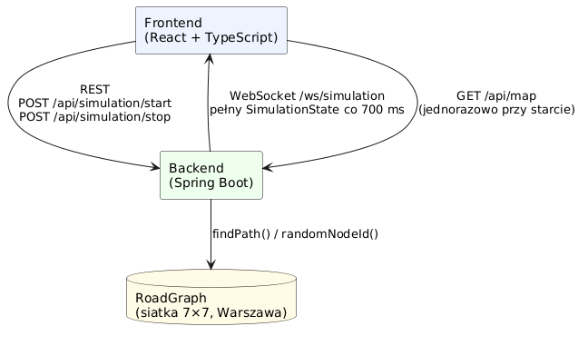
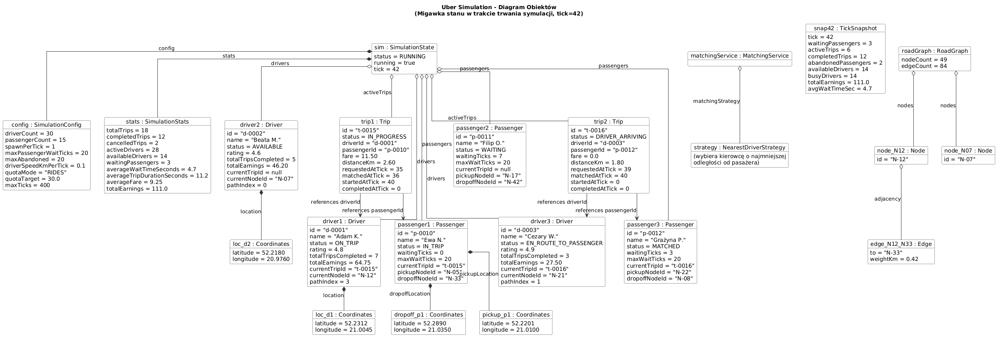
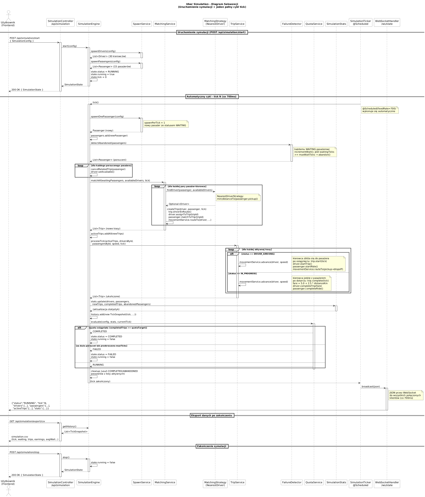
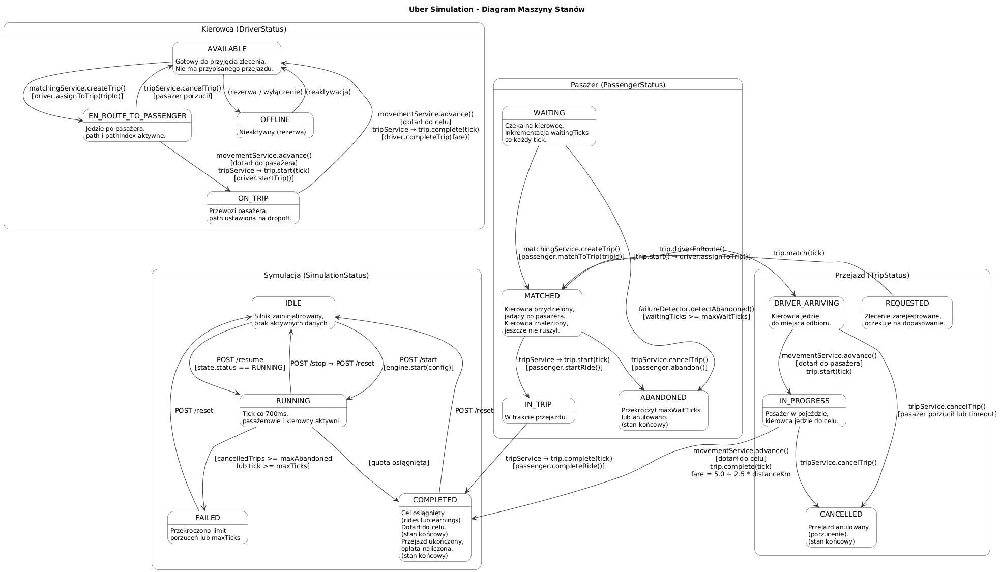

# UberSim — Dokumentacja projektu

**Politechnika Wrocławska · Wydział Informatyki i Telekomunikacji**

Autorzy: Maksym Krasnov, Rafał Gołaszewski, Kacper Grzegorek

Repozytorium: https://github.com/Mkrasnov613/uber-simulation

---

## Spis treści

1. [Wprowadzenie](#1-wprowadzenie)
2. [Architektura systemu](#2-architektura-systemu)
3. [Diagramy UML](#3-diagramy-uml)
4. [Opis klas](#4-opis-klas)
5. [Dziedziczenie](#5-dziedziczenie)
6. [Polimorfizm](#6-polimorfizm)
7. [Hermetyzacja i abstrakcja](#7-hermetyzacja-i-abstrakcja)
8. [Algorytmy i ciekawostki techniczne](#8-algorytmy-i-ciekawostki-techniczne)
9. [Warstwa frontendowa](#9-warstwa-frontendowa)
10. [Symulacja — parametry i przebieg](#10-symulacja--parametry-i-przebieg)
11. [Trudności i sukcesy](#11-trudności-i-sukcesy)
12. [Podsumowanie](#12-podsumowanie)

---

## 1. Wprowadzenie

UberSim to symulacja pracy dyspozytora przewozów typu ride-sharing. Na mapie miasta poruszają się kierowcy i pojawiają się pasażerowie; system kojarzy ich ze sobą, a kierowcy realizują przejazdy, poruszając się po sieci dróg. Celem symulacji jest osiągnięcie zadanego limitu (liczby przejazdów lub zarobku), zanim upłynie czas lub zbyt wielu pasażerów zrezygnuje z oczekiwania.

Projekt składa się z dwóch części:
- **Backend** w języku Java (Spring Boot) — zawiera całą logikę symulacji
- **Frontend** w React + TypeScript — wizualizuje stan na żywo na płótnie Canvas 2D

Komunikacja odbywa się przez REST oraz WebSocket.

---

## 2. Architektura systemu

Kluczowa zasada architektury: *backend posiada całą logikę, frontend jedynie rysuje stan*. Frontend nie podejmuje żadnych decyzji symulacyjnych, dzięki czemu „prawda" znajduje się w jednym miejscu, a wielu klientów może jednocześnie obserwować tę samą sesję (backend przechowuje współdzielony stan jako singleton Spring).

System komunikuje się trzema kanałami:

| Kanał | Endpoint | Opis |
|---|---|---|
| **REST** | `/api/simulation` | Komendy sterujące: `start`, `stop`, `reset`, `status` |
| **WebSocket** | `/ws/simulation` | Pełny `SimulationState` JSON co **700 ms** (`@Scheduled`) |
| **HTTP GET** | `/api/map` | Statyczny graf dróg — pobierany jednorazowo przy starcie |

`SimulationTicker` co 700 ms wywołuje `engine.tick()`, serializuje pełny `SimulationState` do JSON i rozsyła do wszystkich podłączonych klientów (`CopyOnWriteArraySet<WebSocketSession>`).



---

## 3. Diagramy UML

Projekt ilustrują cztery diagramy UML wygenerowane za pomocą PlantUML na podstawie rzeczywistego kodu źródłowego.

### 3.1 Diagram klas


Diagram przedstawia uproszczoną hierarchię klas: dziedziczenie po klasie abstrakcyjnej `SimulationEntity`, realizację interfejsu generycznego `Stateful<T>` przez byty domenowe (`Driver`, `Passenger`, `Trip`), wzorzec Strategia (`MatchingStrategy` z dwiema implementacjami) oraz zależności `SimulationEngine` od pięciu serwisów.

### 3.2 Diagram obiektów



Migawka stanu w ticku 42: trzech kierowców w różnych statusach (`ON_TRIP`, `AVAILABLE`, `EN_ROUTE_TO_PASSENGER`), odpowiadający im pasażerowie i przejazdy, obiekty `Coordinates` oraz węzły grafu dróg. Widoczna jest też aktywna instancja `NearestDriverStrategy` wstrzyknięta do `MatchingService`.

### 3.3 Diagram sekwencji



Dwie fazy: inicjalizacja (`POST /api/simulation/start` generuje kierowców i pasażerów) oraz automatyczny cykl co 700 ms — spawn, wykrywanie porzuceń, kojarzenie par, ruch kierowców, ocena wyniku przez `QuotaService` i rozgłoszenie stanu przez WebSocket.

### 3.4 Diagram maszyny stanów



Cztery automaty stanów:
- **`SimulationStatus`**: `IDLE` → `RUNNING` → `COMPLETED`/`FAILED` → `IDLE`
- **`DriverStatus`**: `AVAILABLE` → `EN_ROUTE_TO_PASSENGER` → `ON_TRIP` → `AVAILABLE`
- **`PassengerStatus`**: `WAITING` → `MATCHED` → `IN_TRIP` → `COMPLETED` lub `ABANDONED`
- **`TripStatus`**: `DRIVER_ARRIVING` → `IN_PROGRESS` → `COMPLETED` lub `CANCELLED`

---

## 4. Opis klas

| Klasa | Odpowiedzialność |
|---|---|
| `SimulationEntity` | Abstrakcyjna klasa bazowa; pola `id` (UUID) i `name`; adnotacje Lombok `@Data`, `@SuperBuilder` |
| `Driver` | Status, lokalizacja, `path` (lista węzłów Dijkstry), `pathIndex`, `totalEarnings`, `totalTripsCompleted` |
| `Passenger` | Status, lokalizacje odbioru i docelowa (jako `Coordinates` i nodeId), licznik `waitingTicks`, limit `maxWaitTicks` |
| `Trip` | Łączy kierowcę i pasażera przez String ID; rejestruje ticki zdarzeń; fare = 5,0 + 2,5 × distanceKm |
| `Coordinates` | Obiekt wartości lat/lng; `distanceTo()` (Haversine), `stepToward()` |
| `RoadGraph` | Siatka 7×7 węzłów nad Warszawą; `findPath()` (Dijkstra), `randomNodeId()`, `generateGrid()` |
| `SimulationEngine` | Orkiestrator; `tick()` wywołuje kolejno 5 serwisów, aktualizuje statystyki, ocenia wynik |
| `SimulationState` | Kontener runtime: listy kierowców, pasażerów, aktywnych przejazdów + `SimulationConfig` + `SimulationStats` |
| `SimulationConfig` | Parametry wejściowe: `driverCount`, `spawnPerTick`, `quotaMode`, `quotaTarget`, `maxTicks`, `maxAbandoned` |
| `SimulationStats` | Metryki: `completedTrips`, `totalEarnings`, `averageWaitTimeSeconds`, `averageTripDurationSeconds` |
| `MatchingService` | Dla każdego czekającego pasażera szuka kierowcy (przez `MatchingStrategy`), tworzy `Trip`, wyznacza trasę |
| `MovementService` | `routeTo()` ustawia `path` przez Dijkstrę; `advance()` przesuwa kierowcę węzeł po węźle |
| `TripService` | Przetwarza aktywne przejazdy: statusy `DRIVER_ARRIVING` → `IN_PROGRESS` → `COMPLETED` |
| `SpawnService` | Tworzy kierowców i pasażerów na losowych węzłach grafu; wywoływany przy starcie i co tick |
| `QuotaService` | Ocenia wynik po każdym ticku: `COMPLETED` / `FAILED` / `RUNNING` |
| `FailureDetector` | Inkrementuje `waitingTicks`; zwraca pasażerów przekraczających `maxWaitTicks` |
| `SimulationTicker` | `@Scheduled(fixedRate = 700)`; wywołuje `tick()` i rozsyła stan przez WebSocket |

---

## 5. Dziedziczenie

Klasa abstrakcyjna `SimulationEntity` dostarcza wspólne pola `id` i `name`:

```java
public abstract class SimulationEntity {
    protected String id;
    protected String name;
}
```

Klasy `Driver`, `Passenger` i `Trip` rozszerzają `SimulationEntity`, dodając własne pola:

```java
public class Driver extends SimulationEntity implements Stateful<DriverStatus> {
    private DriverStatus status;
    private Coordinates location;
    private List<String> path;    // trasa w grafie (Dijkstra)
    private double totalEarnings;
    // ...
}

public class Passenger extends SimulationEntity implements Stateful<PassengerStatus> {
    private PassengerStatus status;
    private Coordinates pickupLocation;
    private Coordinates dropoffLocation;
    private int waitingTicks;
    // ...
}
```

Wszystkie trzy klasy implementują interfejs generyczny `Stateful<T>`:

```java
public interface Stateful<T extends Enum<T>> {
    T getStatus();
    void setStatus(T status);
    boolean isActive();
}
```

Dzięki temu `Driver` używa `DriverStatus`, `Passenger` — `PassengerStatus`, a `Trip` — `TripStatus`, zachowując wspólny kontrakt.

---

## 6. Polimorfizm

Polimorfizm zrealizowano przez wzorzec **Strategia**. Algorytm wyboru kierowcy wydzielono za interfejs `MatchingStrategy`:

```java
public interface MatchingStrategy {
    Optional<Driver> findDriver(Passenger passenger, List<Driver> availableDrivers);
}
```

Dwie wymienne implementacje:
- `NearestDriverStrategy` — wybiera kierowcę o najmniejszej odległości od pasażera
- `RandomDriverStrategy` — wybiera losowego kierowcę

`MatchingService` nie wie, *jak* wybierany jest kierowca — przechowuje referencję do interfejsu:

```java
private final MatchingStrategy matchingStrategy;

public Optional<Driver> findDriver(Passenger passenger, List<Driver> drivers) {
    // typ to interfejs; konkretna implementacja rozstrzygana w czasie wykonania
    return matchingStrategy.findDriver(passenger, drivers);
}
```

Wybór aktywnej implementacji deklarowany przez Spring via `@Primary`:

```java
@Bean
@Primary
public MatchingStrategy matchingStrategy() {
    return new NearestDriverStrategy(); // podmiana tej linii zmienia zachowanie
}
```

---

## 7. Hermetyzacja i abstrakcja

Pola bytów (`Driver`, `Passenger`, `Trip`) są `private`. Dostęp przez gettery/settery generowane przez Lombok `@Data`. Pola `SimulationEntity` są `protected` — dostępne dla podklas, nie dla reszty systemu.

Abstrakcję zapewniają:
- Klasa abstrakcyjna `SimulationEntity` — ukrywa szczegóły tożsamości za wspólnym interfejsem
- Interfejs `Stateful<T>` — abstrahuje nad statusem; `isActive()` działa bez wiedzy o konkretnym enum

Każdy serwis ma dokładnie jedną odpowiedzialność (SRP):

| Serwis | Odpowiedzialność |
|---|---|
| `SpawnService` | Tworzenie bytów |
| `MatchingService` | Kojarzenie par |
| `MovementService` | Ruch kierowców |
| `FailureDetector` | Wykrywanie porzuceń |
| `QuotaService` | Ocena wyniku |

Wewnętrzna struktura `RoadGraph` (węzły, lista sąsiedztwa) jest prywatna; publiczne są tylko `findPath()`, `randomNodeId()`, `toDto()`.

---

## 8. Algorytmy i ciekawostki techniczne

### 8.1 Algorytm Dijkstry — wyznaczanie trasy

Miasto = ważony graf nieskierowany (węzły = skrzyżowania, krawędzie = ulice ważone odległością). `MovementService.routeTo()` wywołuje `RoadGraph.findPath()`:

```java
PriorityQueue<Frontier> pq =
    new PriorityQueue<>(Comparator.comparingDouble(Frontier::dist));
pq.add(new Frontier(startId, 0.0));

while (!pq.isEmpty()) {
    Frontier f = pq.poll();
    if (f.dist() > dist.get(f.nodeId())) continue; // zdezaktualizowany wpis
    if (f.nodeId().equals(targetId)) break;         // cel osiągnięty

    for (Edge e : neighbors(f.nodeId())) {
        double nd = dist.get(f.nodeId()) + e.weightKm();
        if (nd < dist.get(e.to())) {
            dist.put(e.to(), nd);
            prev.put(e.to(), f.nodeId());
            pq.add(new Frontier(e.to(), nd));
        }
    }
}
```

Wynik zapisywany w `driver.path` (lista node ID). `advance()` przesuwa kierowcę węzeł po węźle; dotarcie wykrywane przez `distanceTo < 1e-9`.

### 8.2 Generacja grafu i odległość Haversine

```java
RoadGraph.generateGrid(7, 7, 52.15, 52.35, 20.90, 21.15);
// → 49 węzłów nad Warszawą (52.15–52.35°N, 20.90–21.15°E)
```

Waga krawędzi = rzeczywista odległość ze wzoru Haversine (promień Ziemi R = 6371 km):

$$d = 2R \arctan\!\left(\frac{\sqrt{a}}{\sqrt{1-a}}\right), \quad a = \sin^2\!\frac{\Delta\varphi}{2} + \cos\varphi_1\cos\varphi_2\,\sin^2\!\frac{\Delta\lambda}{2}$$

### 8.3 Interpolacja „dwóch zegarów" (frontend)

Backend: tick co **700 ms**. Frontend: rysowanie **~60 kl./s**.

```typescript
// alpha: 0 (zaraz po ticku) → 1 (tuż przed następnym)
const alpha = Math.min(1, (now - tickStart.current) / TICK_MS);

// lerp pozycji kierowcy
update(alpha: number): Coordinates {
    return {
        latitude:  prevPos.latitude  + (currPos.latitude  - prevPos.latitude)  * alpha,
        longitude: prevPos.longitude + (currPos.longitude - prevPos.longitude) * alpha,
    };
}
```

`applyDto()` przy nowym WebSocket message zapisuje aktualną *wizualną* pozycję jako `prevPos` — eliminuje skoki na ekranie.

### 8.4 Konteneryzacja (Docker)

Multi-stage build:
- **Stage 1** (`gradle:8.7-jdk21`) — kompiluje projekt, produkuje JAR
- **Stage 2** (`eclipse-temurin:21-jre-alpine`) — uruchamia JAR jako nieprivilegowany użytkownik

```bash
docker compose up   # uruchamia cały projekt jednym poleceniem
```

> **Historia buga:** Docker ponownie użył poprzedniej warstwy z nieaktualnym JAR-em. Zmiany w kodzie były niewidoczne w działającej aplikacji. Rozwiązanie: `docker compose build --no-cache`.

---

## 9. Warstwa frontendowa

### 9.1 React — komponenty i hooks

Frontend zbudowany w **React** (TypeScript). Komponenty:

| Komponent | Rola |
|---|---|
| `SimulationSetup` | Panel konfiguracji; zapisuje parametry do `localStorage` |
| `StatsGrid`, `TopBar` | Statystyki na żywo (HUD) |
| `DriverList` | Lista kierowców z ich statusami |
| `MapCanvas` | Mapa rysowana przez Canvas 2D |

Podział architektoniczny:
- **HUD** (statystyki, przyciski) → React DOM — deklaratywne
- **Mapa** → Canvas 2D API — imperatywne, 60 fps

React jest za wolny na re-renderowanie wielu poruszających się obiektów 60 razy na sekundę. Canvas 2D rysuje bezpośrednio na buforze pikseli.

### 9.2 Canvas 2D — rysowanie mapy

```typescript
function frame(now: number) {
    const alpha = Math.min(1, (now - tickStart.current) / TICK_MS);

    ctx.fillStyle = "#0a0e15";                        // wyczyść klatkę
    ctx.fillRect(0, 0, size.current.width, size.current.height);

    drawRoads(ctx, roadMap, bounds, size.current);    // drogi i węzły
    // ... trasy aktywnych przejazdów (polylines)
    // ... pasażerowie (ikony)
    // ... kierowcy (kolorowe okręgi)

    requestAnimationFrame(frame);
}
```

**Rzutowanie współrzędnych** — geo (lat/lng) → piksele ekranu:

```typescript
function project(coords, bounds, width, height, padding = 50) {
    const x = padding + (coords.longitude - bounds.minLng)
                      / (bounds.maxLng - bounds.minLng)
                      * (width - 2 * padding);

    const y = padding + (bounds.maxLat - coords.latitude)  // oś Y odwrócona
                      / (bounds.maxLat - bounds.minLat)
                      * (height - 2 * padding);
    return { x, y };
}
```

**Legenda mapy:**

| Element | Wygląd |
|---|---|
| Drogi | Cienkie linie, `rgba(120,144,190,0.18)` |
| Węzły (skrzyżowania) | Małe kropki, `rgba(140,165,210,0.35)` |
| Kierowca AVAILABLE | Zielony okrąg |
| Kierowca EN_ROUTE | Pomarańczowy okrąg |
| Trasa DRIVER_ARRIVING | Przerywana bursztynowa linia |
| Trasa IN_PROGRESS | Ciągła zielona linia |

---

## 10. Symulacja — parametry i przebieg

### Parametry konfiguracji

| Parametr | Domyślna wartość | Opis |
|---|---|---|
| `driverCount` | 30 | Liczba kierowców na starcie |
| `passengerCount` | 15 | Pasażerowie zasiewu (tick 0) |
| `spawnPerTick` | 1 | Nowi pasażerowie co tick |
| `maxPassengerWaitTicks` | 20 | Limit oczekiwania (ticki) |
| `maxAbandoned` | 20 | Max porzuceń zanim przegrana |
| `driverSpeedKmPerTick` | 0.1 | Prędkość kierowcy [km/tick] |
| `quotaMode` | `RIDES` | Tryb celu: `RIDES` lub `EARNINGS` |
| `quotaTarget` | 30 | Cel do osiągnięcia |
| `maxTicks` | 400 | Limit czasu symulacji |

### Cykl tick()

Co 700 ms `SimulationEngine.tick()` wykonuje 5 kroków:

1. **Spawn** — `SpawnService` dodaje `spawnPerTick` nowych pasażerów (`WAITING`)
2. **Porzucenia** — `FailureDetector` inkrementuje `waitingTicks`; przekraczający limit → `ABANDONED`; powiązane przejazdy anulowane
3. **Kojarzenie** — `MatchingService` kojarzy czekających pasażerów z wolnymi kierowcami przez `MatchingStrategy`; tworzy `Trip`; wyznacza trasę (Dijkstra)
4. **Ruch** — `TripService` przesuwa kierowców; obsługuje przejścia `DRIVER_ARRIVING` → `IN_PROGRESS` → `COMPLETED`
5. **Ocena** — `QuotaService` sprawdza warunki zakończenia

### Warunki zakończenia

| Wynik | Warunek |
|---|---|
| **Wygrana** (`COMPLETED`) | `completedTrips >= quotaTarget` (RIDES) lub `totalEarnings >= quotaTarget` (EARNINGS) |
| **Przegrana** (`FAILED`) | `cancelledTrips >= maxAbandoned` lub `tick >= maxTicks` |
| **Kontynuacja** (`RUNNING`) | Żaden z powyższych |

### Eksport wyników

Po zakończeniu historia ticków (`TickSnapshot`) dostępna przez:
- `GET /api/simulation/export/json` — dane dla Google Sheets
- `GET /api/simulation/export/csv` — plik CSV

Skrypt Google Apps Script pobiera dane i automatycznie generuje wykres liniowy *System State Over Time* z kolumnami: Waiting Passengers, Active Trips, Completed Trips, Abandoned.

---

## 11. Trudności i sukcesy

### Trudności

**Główna trudność — ruch po drogach (graf + Dijkstra):**
Wymagało zaprojektowania `RoadGraph` z mapą węzłów i listą sąsiedztwa, poprawnej implementacji Dijkstry (obsługa zdezaktualizowanych wpisów w kolejce, odwrócenie ścieżki), i synchronizacji `pathIndex` z `advance()`. Każdy etap generował inne błędy — kierowcy teleportowali się, zatrzymywali lub ignorowali cel.

**Konfiguracja WebSocket:**
Poprawne ustawienie CORS, zarządzanie sesjami przez `CopyOnWriteArraySet`, synchronizacja dostępu (`synchronized(session)`) w warunkach wielowątkowych.

**Pozostałe problemy:**
- Błąd współrzędnych — mapa renderowała się nad Los Angeles (domyślne `0°N 0°E`)
- Stary artefakt w cache Dockera — zmiany w kodzie niewidoczne w aplikacji
- „Zacinająca się" animacja — rozwiązana przez interpolację w `applyDto()`

### Sukcesy

- Kierowcy poruszają się po sieci dróg wyznaczonej algorytmem Dijkstry
- Płynna animacja 60 kl./s przy danych co 700 ms (interpolacja dwóch zegarów)
- Konfigurowalna i *wygrywalna* symulacja z dwoma trybami celu: `RIDES` i `EARNINGS`
- Czysty podział SRP: każdy serwis ma jedną odpowiedzialność, frontend bez logiki domenowej
- Uruchomienie całości jednym poleceniem: `docker compose up`

---

## 12. Podsumowanie

Zrealizowano kompletną symulację systemu ride-sharing: backend w Spring Boot z pełną logiką domenową (graf dróg, algorytm Dijkstry, wzorzec Strategia, pętla symulacji z dwoma trybami celu) oraz frontend w React + TypeScript wizualizujący stan na żywo przez WebSocket. Projekt działa w środowisku kontenerowym Docker.

**Planowane rozszerzenia:**
- Konfigurowanie parametrów generacji mapy (rozmiar siatki, obszar geograficzny) przez użytkownika — wystarczy przenieść wartości z `MapConfig` do `SimulationConfig` i odbudowywać graf przy każdym starcie
- Tryb EARNINGS widoczny w statystykach HUD
- Mapa oparta na danych OpenStreetMap

**Repozytorium:** https://github.com/Mkrasnov613/uber-simulation
